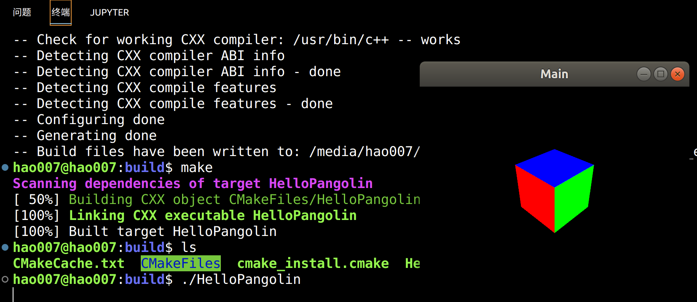

# hao_lib
自己安装各种库的集合
# 01 opencv
```
mkdir opencv4.6
cd opencv4.6
git clone https://github.com/opencv/opencv.git
git clone https://github.com/opencv/opencv_contrib.git
mkdir install
```
```
cd opencv
git checkout 4.6.0
cd opencv_contrib
git checkout 4.6.0  
```
```
sudo apt install build-essential cmake git pkg-config libgtk-3-dev \
    libavcodec-dev libavformat-dev libswscale-dev libv4l-dev \
    libxvidcore-dev libx264-dev libjpeg-dev libpng-dev libtiff-dev \
    gfortran openexr libatlas-base-dev python3-dev python3-numpy \
    libtbb2 libtbb-dev libdc1394-22-dev libopenexr-dev \
    libgstreamer-plugins-base1.0-dev libgstreamer1.0-dev
```
```
cd opencv
mkdir build
cd build
cmake -D CMAKE_BUILD_TYPE=RELEASE -D CMAKE_INSTALL_PREFIX=/home/slam007/app/opencv3.4.5/install/ -D OPENCV_EXTRA_MODULES_PATH=/home/slam007/app/opencv3.4.5/opencv_contrib/modules/ -DOPENCV_ENABLE_NONFREE:BOOL=TRUE ..
```

```
make
sudo make install
```
## 02 Panglin
```
git clone https://github.com/stevenlovegrove/Pangolin.git
sudo apt install libglew-dev
cd Pangolin
mkdir build
cd build
cmake ..
make
sudo make install
sudo ldconfig
```

Pangolin_example




## 03 Sophus

`fmt`
fmt库的安装
```
git clone  https://github.com/fmtlib/fmt.git # 注意要使用8或者7版本的，9的会报错，git checkout 7.1.3
git checkout -b 8.1.1
cd fmt
mkdir build
cd build 
cmake ..
make
sudo make install
```
Sophus李代数库的安装
```
git clone http://github.com/strasdat/Sophus.git
cd Sophus
mkdir build
cd build 
cmake ..
make
sudo make install
```

## 04 G2O
```
sudo apt-get install cmake libeigen3-dev libsuitesparse-dev qtdeclarative5-dev qt5-qmake libqglviewer-dev-qt5
git clone https://github.com/RainerKuemmerle/g2o.git
cd g2o
mkdir build
cd build
cmake ..
make
suao make install
```


安装依赖项
```
sudo apt-get install libglew-dev
sudo apt-get install libboost-dev libboost-thread-dev libboost-filesystem-dev
sudo apt-get install libpython2.7-dev
```
安装Pangolin

```
 git clone https://github.com/stevenlovegrove/Pangolin.git
 cd Pangolin
 mkdir build 
 cd build 
 cmake -DCPP11_NO_BOOSR=1 .. 
 make -j4
```

安装eigen3

```
sudo apt-get install libeigen3-dev
```

## 05 PCL
